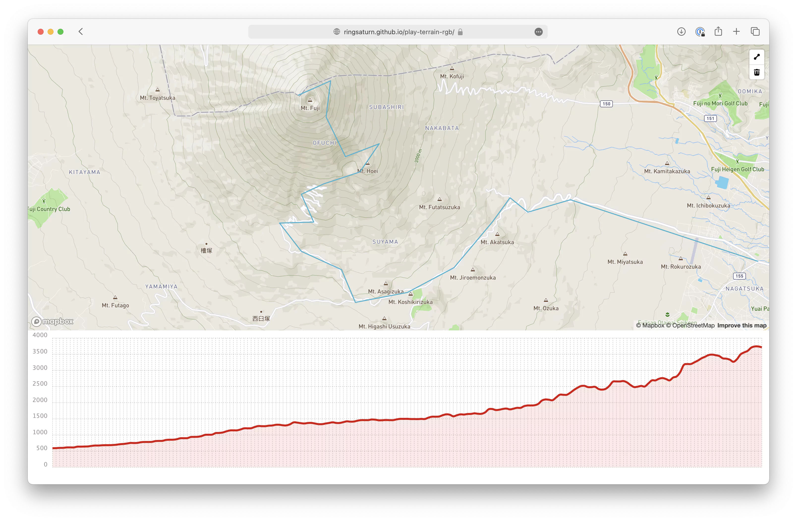

# Play terrain rgb

Data process follow: <https://github.com/syncpoint/terrain-rgb>

Try it online:

[](https://ringsaturn.github.io/play-terrain-rgb/)

---

```bash
brew install gdal geoip libspatialite librasterlite spatialite-gui spatialite-tools
```

```bash
pip install rasterio --no-binary rasterio
pip install -r requirements.txt
```

Mt Fuji `138.72739076614383 35.36067113569001`

```bash
rio info --indent 2 ASTGTMV003_N35E138_dem.tif
```

Output:

```json
{
  "blockxsize": 256,
  "blockysize": 256,
  "bounds": [
    137.999861111111,
    34.99986111111112,
    139.00013888888876,
    36.0001388888889
  ],
  "colorinterp": [
    "gray"
  ],
  "compress": "lzw",
  "count": 1,
  "crs": "EPSG:4326",
  "descriptions": [
    "Band 1"
  ],
  "driver": "GTiff",
  "dtype": "int16",
  "height": 3601,
  "indexes": [
    1
  ],
  "interleave": "band",
  "lnglat": [
    138.4999999999999,
    35.500000000000014
  ],
  "mask_flags": [
    [
      "all_valid"
    ]
  ],
  "nodata": null,
  "res": [
    0.000277777777777778,
    0.000277777777777778
  ],
  "shape": [
    3601,
    3601
  ],
  "tiled": true,
  "transform": [
    0.000277777777777778,
    0.0,
    137.999861111111,
    0.0,
    -0.000277777777777778,
    36.0001388888889,
    0.0,
    0.0,
    1.0
  ],
  "units": [
    null
  ],
  "width": 3601
}
```

Clip range around Mt Everest:

```bash
gdal_translate -projwin 138.626942 35.439672 138.899882  35.255449 ASTGTMV003_N35E138_dem.tif ASTGTMV003_N35E138_dem_clip.tif
```

```bash
gdalwarp -t_srs EPSG:3857  -dstnodata None  -novshiftgrid -co TILED=YES  -co COMPRESS=DEFLATE  -co BIGTIFF=IF_NEEDED -r lanczos ASTGTMV003_N35E138_dem_clip.tif  ASTGTMV003_N35E138_dem_clip_EPSG3857.tif
```

```txt
Creating output file that is 914P x 756L.
Processing ASTGTMV003_N35E138_dem_clip.tif [1/1] : 0...10...20...30...40...50...60...70...80...90...100 - done.
```

```bash
rio info --indent 2 ASTGTMV003_N35E138_dem_clip_EPSG3857.tif
```

```json
{
  "blockxsize": 256,
  "blockysize": 256,
  "bounds": [
    15431865.404742576,
    4198669.725048377,
    15462269.950626153,
    4223818.342868929
  ],
  "colorinterp": [
    "gray"
  ],
  "compress": "deflate",
  "count": 1,
  "crs": "EPSG:3857",
  "descriptions": [
    "Band 1"
  ],
  "driver": "GTiff",
  "dtype": "int16",
  "height": 756,
  "indexes": [
    1
  ],
  "interleave": "band",
  "lnglat": [
    138.76336989692504,
    35.347779733715655
  ],
  "mask_flags": [
    [
      "all_valid"
    ]
  ],
  "nodata": null,
  "res": [
    33.265367487502644,
    33.265367487502644
  ],
  "shape": [
    756,
    914
  ],
  "tiled": true,
  "transform": [
    33.265367487502644,
    0.0,
    15431865.404742576,
    0.0,
    -33.265367487502644,
    4223818.342868929,
    0.0,
    0.0,
    1.0
  ],
  "units": [
    null
  ],
  "width": 914
}
```

```bash
rio rgbify -b -10000  -i 0.001 ASTGTMV003_N35E138_dem_clip_EPSG3857.tif ASTGTMV003_N35E138_dem_clip_EPSG3857.RGB.tif
```

Try read original height

```bash
gdallocationinfo -wgs84 ASTGTMV003_N35E138_dem.tif 138.72739076614383 35.36067113569001
```

```console
Report:
  Location: (2619P,2302L)
  Band 1:
    Value: 3756
```

```bash
gdallocationinfo -wgs84 ASTGTMV003_N35E138_dem_clip_EPSG3857.RGB.tif 138.72739076614383 35.36067113569001
```

```console
Report:
  Location: (336P,325L)
  Band 1:
    Value: 209
  Band 2:
    Value: 234
  Band 3:
    Value: 72
```

Formula as:

```py
# 0.001 came from `rio rgbify`'s `-i` option
height = -10000 + ((R * 256 * 256 + G * 256 + B) * 0.001)
```

So:

```py
height = -10000 + ((209 * 256 * 256 + 234 * 256 + 72) * 0.001)
# 3757
```

Make zoom=5-19

```bash
time gdal2tiles.py --zoom=5-19 --processes=16 ASTGTMV003_N35E138_dem_clip_EPSG3857.RGB.tif ./tiles
```

```txt
Generating Base Tiles:
...10...20...30...40...50...60...70...80...90...100 - done.
Generating Overview Tiles:
0...10...20...30...40...50...60...70...80...90...100 - done.
gdal2tiles.py --zoom=5-19 --processes=16  ./tiles  1332.07s user 360.34s system 1297% cpu 2:10.39 total
```

```bash
mb-util --image_format=png --scheme=tms ./tiles/ ./ASTGTMV003_N35E138_dem_clip_EPSG3857.RGB.mbtiles
```

```txt
176000 tiles inserted (24076 tiles/sec)mb-util --image_format=png --scheme=tms ./tiles/   2.12s user 3.92s system 75% cpu 7.995 total
```
